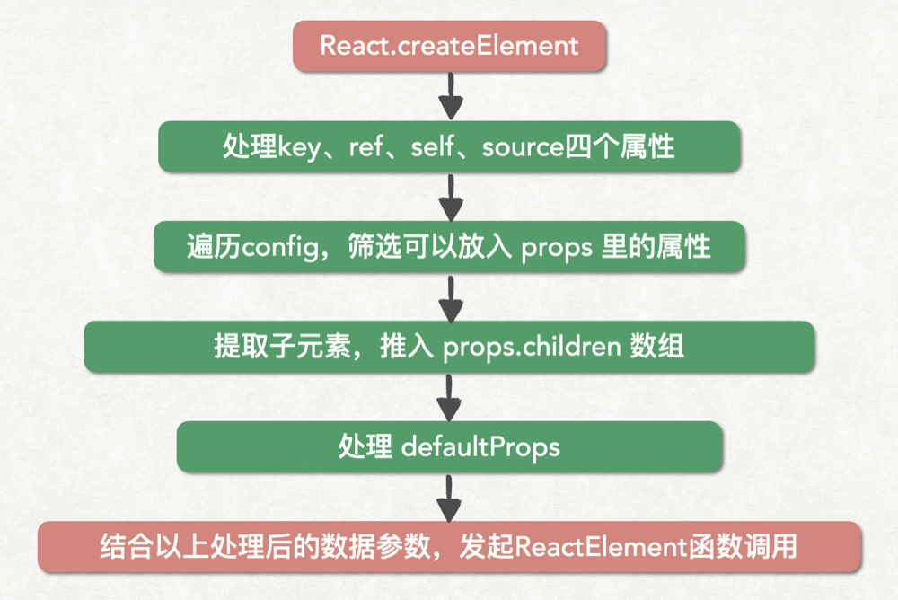

# React原理深入浅出

在我们使用React中，其主要核心部分可以分为以下几点：

- JSX
- Fiber树
- Reconciler
- Scheduler
- Class Component
- Hooks (Function Component)

下面我们就围绕以上几点核心来分析React的原理。

## 理解JSX

我们从以下三个问题来理解JSX：

### 问题一：JSX的本质是什么，它和JS之间到底是什么关系？

我们来看一下[React官网](https://reactjs.org/docs/glossary.html#jsx)对它的定义：

    JSX 是 JavaScript 的一种语法扩展，它和模板语言很接近，但是它充分具备 JavaScript 的能力。

这段描述可能并不能很好的理解，我们可以这样来理解：

    JSX是用于描述DOM的语法，它会被babel编译为React.createElement的函数调用，其本质就是JS。也可说：JSX是React.createElement函数调用的语法糖

#### 示例：

编译前：

```jsx
const jsx = <div id="root">hello</div>
```

编译后：

```jsx
const jsx = React.createElement("div", {
  id: "root"
}, "hello");
```

浏览器并不能识别并执行JSX，因此，如果需要在使用它，就需要使用babel编译成浏览器或者其他环境可识别的JS代码。

#### 那什么是babel呢？它又是怎样把JSX编译成JS的呢?

```babel
Babel 是一个工具链，主要用于将 ECMAScript 2015+ 版本的代码转换为向后兼容的 JavaScript 语法，以便能够运行在当前和旧版本的浏览器或其他环境中。
—— Babel 官网
```

babel的功能描述是 `将 ECMAScript 2015+ 版本的代码转换为向后兼容的 JavaScript 语法...` ，其功能之一就是 `语法转换` , Babel 也具备将 JSX 语法转换为 JavaScript 代码的能力（依赖官方插件 `@babel/preset-react`）。

### 问题二：为什么要用JSX？

既然JSX的本质是 React.createElement调用，那为何 React 官方不直接引导我们使用 React.createElement 元素呢？

我们来看一下下面的代码


可以看出来JSX层次分明、嵌套关系清晰，而 React.createElement 代码看起来就会非常混乱，随着嵌套层次的加速，更是难以编写和维护。

JSX 语法糖允许前端开发者使用我们最为熟悉的类 HTML 标签语法来创建虚拟 DOM，在降低学习成本的同时，也提升了研发效率与研发体验。

### 问题三：JSX背后的功能模块是什么，这个功能模块都做了哪些事情？

这个问题在上面已经得到了解答，JSX背后的功能模块就是 React.createElement函数调用，下面我们走进源码看一下它到底做了啥。

```js
/**
 * React的创建元素方法
 */
export function createElement(type, config, children) {
  // propName 变量用于储存后面需要用到的元素属性
  let propName; 
  // props 变量用于储存元素属性的键值对集合
  const props = {}; 
  // key、ref、self、source 均为 React 元素的属性，此处不必深究
  let key = null;
  let ref = null; 
  let self = null; 
  let source = null; 
  // config 对象中存储的是元素的属性
  if (config != null) { 
    // 进来之后做的第一件事，是依次对 ref、key、self 和 source 属性赋值
    if (hasValidRef(config)) {
      ref = config.ref;
    }
    // 此处将 key 值字符串化
    if (hasValidKey(config)) {
      key = '' + config.key; 
    }
    self = config.__self === undefined ? null : config.__self;
    source = config.__source === undefined ? null : config.__source;
    // 接着就是要把 config 里面的属性都一个一个挪到 props 这个之前声明好的对象里面
    for (propName in config) {
      if (
        // 筛选出可以提进 props 对象里的属性
        hasOwnProperty.call(config, propName) &&  /
        !RESERVED_PROPS.hasOwnProperty(propName) 
      ) {
        props[propName] = config[propName]; 
      }
    }
  }
  // childrenLength 指的是当前元素的子元素的个数，减去的 2 是 type 和 config 两个参数占用的长度
  const childrenLength = arguments.length - 2; 
  // 如果抛去type和config，就只剩下一个参数，一般意味着文本节点出现了
  if (childrenLength === 1) { 
    // 直接把这个参数的值赋给props.children
    props.children = children; 
    // 处理嵌套多个子元素的情况
  } else if (childrenLength > 1) { 
    // 声明一个子元素数组
    const childArray = Array(childrenLength); 
    // 把子元素推进数组里
    for (let i = 0; i < childrenLength; i++) { 
      childArray[i] = arguments[i + 2];
    }

    // 最后把这个数组赋值给props.children
    props.children = childArray; 
  } 

  // 处理 defaultProps
  if (type && type.defaultProps) {
    const defaultProps = type.defaultProps;
    for (propName in defaultProps) { 
      if (props[propName] === undefined) {
        props[propName] = defaultProps[propName];
      }
    }
  }

  // 最后返回一个调用ReactElement执行方法，并传入刚才处理过的参数
  return ReactElement(
    type,
    key,
    ref,
    self,
    source,
    ReactCurrentOwner.current,
    props,
  );
}
```

createElement 入参有 3 个，这 3 个参数包含了 React 创建一个元素所需要知道的全部信息。

- type: 标识节点类型。它可以是类似“h1”“div”这样的标准 HTML 标签字符串，也可以是React组件类型或者React Fragment类型。
- config: 以对象形式传入，组件所有的属性都会以键值对的形式存储在 config 对象中。
- children: 从第三个入参开始往后，传入的参数都是 children，格式可能是“任意JS类型”，它记录的是组件标签之间嵌套的内容，也就是所谓的“子节点”。

从 createElement 源码中可以提取出一个流程图：



从图中其实可以看出：createElement 就像是开发者和 ReactElement 调用之间的一个“转换器”、一个数据处理层。它可以从开发者处接受相对简单的参数，然后将这些参数按照 ReactElement 的预期做一层格式化，最终通过调用 ReactElement 来实现元素的创建。

下面我们来看 ReactElement 源码：

```jsx
const ReactElement = function(type, key, ref, self, source, owner, props) {
  const element = {
    // REACT_ELEMENT_TYPE是一个常量，用来标识该对象是一个ReactElement
    $$typeof: REACT_ELEMENT_TYPE,
    // 内置属性赋值
    type: type,
    key: key,
    ref: ref,
    props: props,
    // 记录创造该元素的组件
    _owner: owner,
  };
  if (__DEV__) {
    // 这里是一些针对 __DEV__ 环境下的处理，对于大家理解主要逻辑意义不大，此处我直接省略掉，以免混淆视听
  }
  return element;
};
```

从逻辑上我们可以看出，ReactElement 其实只做了一件事情，那就是“创建”，说得更精确一点，是“组装”：ReactElement 把传入的参数按照一定的规范，“组装”进了 element 对象里，并把它返回给了 React.createElement，最终 React.createElement 又把它交回到了开发者手中。整个过程如下图所示：


## Fiber树

## Reconciler

## Scheduler

## Class Component

## Hooks (Function Component)